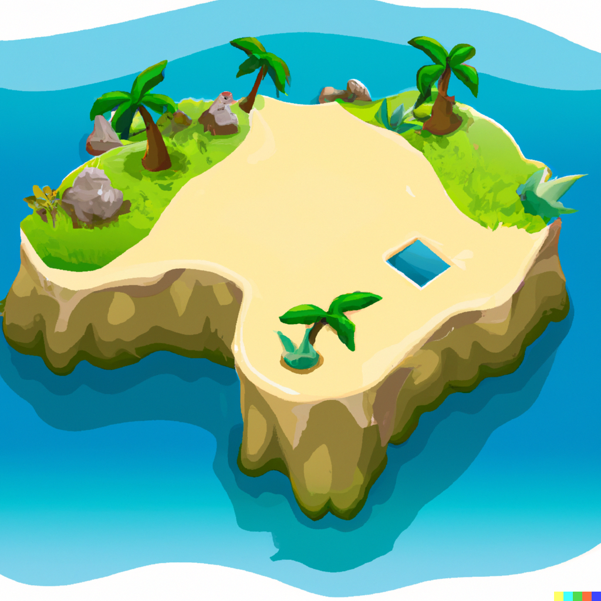

<README>

[![Contributors][contributors-shield]][contributors-url]
[![Forks][forks-shield]][forks-url]
[![Stargazers][stars-shield]][stars-url]
[![Issues][issues-shield]][issues-url]
[![MIT License][license-shield]][license-url]
[![LinkedIn][linkedin-shield]][linkedin-url]

 

  

<h3 align="center">A_game</h3>

  

    A text-based adventure game coded in C++, reminiscent of text-based games from the 80's
     
    <a href="https://github.com/github_username/A_game"><strong>Explore the docs »</strong></a>
     
     
    <a href="https://github.com/github_username/A_game">View Demo</a>
    ·
    <a href="https://github.com/github_username/A_game/issues">Report Bug</a>
    ·
    <a href="https://github.com/github_username/A_game/issues">Request Feature</a>
  

  
Table of Contents

  <ol>
    <li>
      <a href="#about-the-project">About The Project</a>
    </li>
    <li><a href="#game-objective">Game Objective</a></li>
  </ol>

## About The Project

[![A_game Screenshot][product-screenshot]](https://example.com)

A_game is a text-based adventure game coded in C++, designed to be reminiscent of text-based games from the 80's.

(<a href="#readme-top">back to top</a>)

## Game Objective

You wake up to find yourself alone on an island in the middle of the ocean. You can see a cruise ship on the horizon. Attached to the island are three paths all going in the direction of the ship. No one path seems better than any other; which path will you choose?

Each path contains a random chance for an event during each distance unit (measured in miles). You can collect items to help you along your way; these items can improve your chances during battles, or potentially decrease your distance from the cruise ship.

(<a href="#readme-top">back to top</a>)

[contributors-shield]: https://img.shields.io/github/contributors/Yalton/a_game.svg?style=for-the-badge
[contributors-url]: https://github.com/Yalton/a_game/graphs/contributors
[forks-shield]: https://img.shields.io/github/forks/Yalton/a_game.svg?style=for-the-badge
[forks-url]: https://github.com/Yalton/a_game/network/members
[stars-shield]: https://img.shields.io/github/stars/Yalton/a_game.svg?style=for-the-badge
[stars-url]: https://github.com/Yalton/a_game/stargazers
[issues-shield]: https://img.shields.io/github/issues/Yalton/a_game.svg?style=for-the-badge
[issues-url]: https://github.com/Yalton/a_game/issues
[license-shield]: https://img.shields.io/github/license/Yalton/a_game.svg?style=for-the-badge
[license-url]: https://github.com/Yalton/a_game/blob/master/LICENSE.txt
